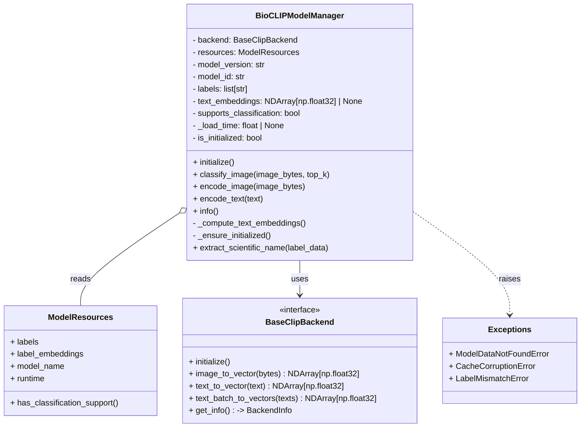

# BioCLIP Class Diagram

This document provides a class-level view of the main types involved in the BioCLIP implementation found at `src/lumen_clip/expert_bioclip/bioclip_model.py`. Use this to understand the relationships between the manager, its dependencies, and the important fields and methods you will encounter when reading or modifying the code.

I recommend you open `src/lumen_clip/expert_bioclip/bioclip_model.py` while following this diagram to map fields and methods directly to implementation.

Key points explained

- `BioCLIPModelManager`
  - The central business-layer class that coordinates inference and classification.
  - Holds preloaded `labels` and (optionally) `text_embeddings` from `ModelResources`.
  - Delegates encoding work to a `BaseClipBackend` implementation (injected).
  - Exposes public APIs:
    - `initialize()` — prepares backend and computes embeddings if necessary.
    - `classify_image(image_bytes, top_k)` — returns top-k (scientific_name, probability).
    - `encode_image` / `encode_text` — thin wrappers around backend encoding + prompt shaping.
    - `info()` — returns runtime and metadata summary.
  - Internal helpers:
    - `_compute_text_embeddings()` — attempts batch embedding; falls back to sequential.
    - `_ensure_initialized()` — guards public inference methods.
    - `extract_scientific_name()` — maps TreeOfLife label structure to "Genus species".

- `BaseClipBackend`
  - An interface that the manager depends on for all vector operations.
  - Must provide both single and batch text encoding if available; manager will fallback to sequential if batch fails.
  - `get_info()` should provide a small struct with runtime/model metadata used by `info()`.

- `ModelResources`
  - Responsible for providing prior-saved artifacts:
    - `labels` — the TreeOfLife labels (complex nested structure in some datasets).
    - `label_embeddings` — optional, precomputed text embeddings for labels.
    - `model_name`, `runtime`, and a helper `has_classification_support()`.

- Exceptions
  - The module defines several domain exceptions (e.g., `ModelDataNotFoundError`) that the manager may raise when dataset or embeddings are missing/corrupt.

Mapping to implementation
- The canonical implementation lives in:
  - `src/lumen_clip/expert_bioclip/bioclip_model.py`
- When you inspect that file, pay attention to:
  - How `resources.labels` is converted to `self.labels`.
  - How `self.text_embeddings` is set from `resources.label_embeddings` or computed in `_compute_text_embeddings`.
  - The softmax & top-k logic inside `classify_image()`.

Usage tips
- When adding a new backend, ensure it implements the `BaseClipBackend` method signatures used by the manager.
- When adding or modifying datasets in `ModelResources`, keep `has_classification_support()` consistent with whether `label_embeddings` or `labels` are present.
- For debugging classification mismatches, inspect:
  - `self.labels` contents and ordering
  - `self.text_embeddings` shape and dtype (should be float32)
  - backend image/text embedding dimensionality returned by `get_info()`
