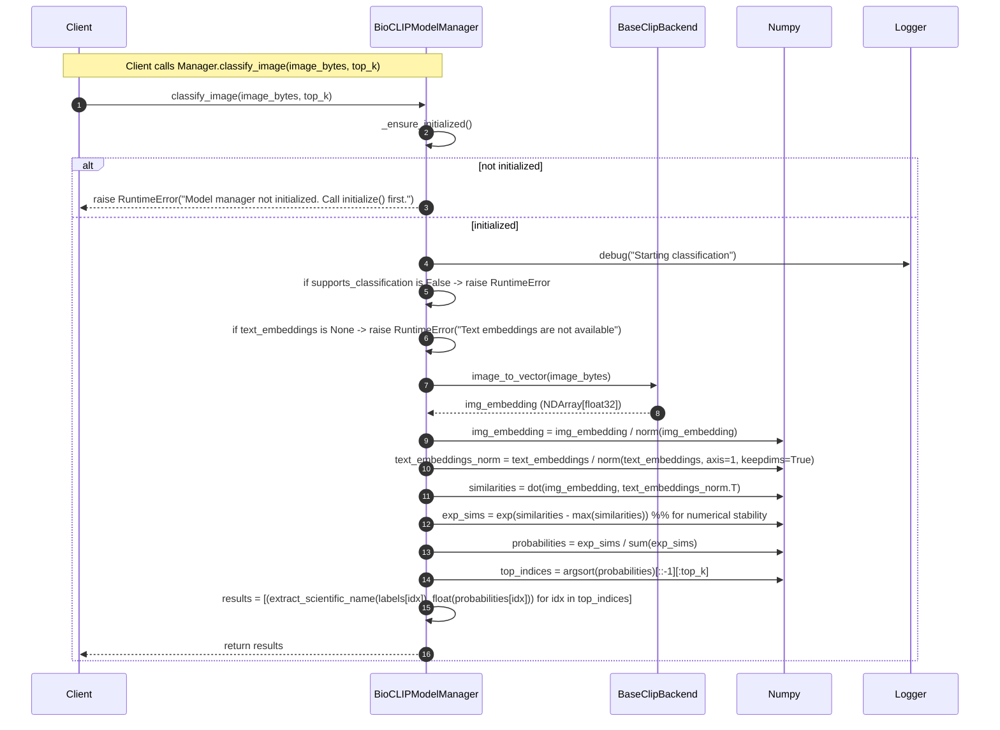

# BioCLIP Classification Sequence

This document describes the runtime classification sequence for `BioCLIPModelManager.classify_image()` as implemented in `src/lumen_clip/expert_bioclip/bioclip_model.py`. It captures the call flow, the key data transformations (image → embedding → similarity → softmax → top-k), error/failure conditions, and debugging guidance.

Use this to:
- Understand the end-to-end runtime behavior for image classification.
- Debug shape/dtype/compatibility issues between backend and precomputed label embeddings.
- Communicate the expected responsibilities of `BaseClipBackend` and `ModelResources`.

Important artifacts and attributes
- `BioCLIPModelManager.backend` — injected backend implementing `BaseClipBackend`.
- `BioCLIPModelManager.resources` — `ModelResources` instance (provides `labels`, `label_embeddings`, `model_name`, `runtime`).
- `BioCLIPModelManager.labels` — list of label structures derived from `resources.labels`.
- `BioCLIPModelManager.text_embeddings` — precomputed `resources.label_embeddings` or computed at init.
- `BioCLIPModelManager.supports_classification` — boolean indicating dataset presence.
- `BioCLIPModelManager.is_initialized` — must be True before inference.
- `BaseClipBackend.image_to_vector(image_bytes)` — returns a unit-normalized image embedding (NDArray[np.float32]).
- `BaseClipBackend.text_to_vector(prompt)` / `text_batch_to_vectors(prompts)` — text embedding providers used during embedding computation.

Step-by-step explanation
1. Caller invokes `classify_image(image_bytes, top_k)`.
2. Manager calls `_ensure_initialized()` — if the manager is not initialized a `RuntimeError` is raised and classification halts.
3. Manager checks `supports_classification` — if False a `RuntimeError` is raised with guidance about missing dataset support.
4. Manager verifies `text_embeddings` exists — if None, classification cannot proceed (in this implementation text embeddings should be present at initialization).
5. Manager delegates image encoding to `backend.image_to_vector(image_bytes)`.
   - Expected: a NumPy array of dtype float32 and shape (D,). The backend may already return a unit-normalized vector per the manager's expectations; the manager explicitly normalizes again to ensure unit norm.
6. Manager normalizes both image embedding and the label text embeddings:
   - `img_embedding = img_embedding / norm(img_embedding)` (ensures unit norm)
   - `text_embeddings_norm = text_embeddings / norm(text_embeddings, axis=1, keepdims=True)`
   - Check for zero norms — if a zero vector appears this will produce NaNs. Backends should not return zero vectors.
7. Manager computes cosine similarities as a dot product:
   - `similarities = np.dot(img_embedding, text_embeddings_norm.T)` → shape (N_labels,)
8. Convert similarities to probabilities:
   - Numerical stability: subtract `max(similarities)` before exponentiation.
   - `probabilities = exp_sims / sum(exp_sims)`
9. Retrieve the top-K highest probabilities:
   - `top_indices = np.argsort(probabilities)[::-1][:top_k]`
10. Convert label structures to human-readable scientific names via `extract_scientific_name(label_data)`.
11. Return a list of `(scientific_name, probability)` tuples sorted by descending probability.

Failure modes and debugging tips
- Manager not initialized
  - Symptom: `RuntimeError("Model manager not initialized. Call initialize() first.")`
  - Fix: Call `initialize()` and inspect logs for initialization failures.
- Classification not supported
  - Symptom: `RuntimeError("Classification not supported: no dataset loaded.")`
  - Fix: Ensure `ModelResources.has_classification_support()` returns True and that `resources.labels` exists.
- Missing text embeddings
  - Symptom: `RuntimeError("Text embeddings are not available")`
  - Fix: Precompute and supply `resources.label_embeddings`, or ensure `_compute_text_embeddings()` succeeded during init.
- Embedding dimensionality mismatch
  - Symptom: shape error when computing dot product (e.g., shapes (D_img,) and (N_labels, D_text) with D_img != D_text)
  - Fix: Verify backend produces embeddings of the same dimensionality for images and text. Check `backend.get_info().image_embedding_dim` and `text_embeddings.shape[1]`.
- Zero or NaN embeddings
  - Symptom: NaNs in probabilities or returned results are NaN/inf
  - Fix: Inspect returned arrays; ensure backend normalizes or returns meaningful vectors. Add defensive checks to detect zero norms and raise informative errors.
- Softmax numerical instability
  - Symptom: overflow/underflow in exp
  - Fix: Manager already uses `similarities - max(similarities)` trick. If extremely large values persist, check backend scaling or consider temperature scaling before softmax (e.g., divide similarities by a temperature > 0).
- Ordering mismatch between labels and embeddings
  - Symptom: top predictions' scientific names do not match expected labels for known inputs.
  - Fix: Ensure `self.labels` order matches rows in `self.text_embeddings`. If embeddings were loaded separately, confirm consistent indexing.

Best practices
- Always call `initialize()` once at startup. For long-running services, perform health checks on initialization and surface backend diagnostics.
- Prefer precomputing `label_embeddings` in `ModelResources` for large label sets — this avoids runtime latency and memory spikes during initialization.
- Validate backend `get_info()` metadata during initialization and surface a warning if embedding dimensions are inconsistent.
- Add logging at DEBUG level around shapes and dtypes (only in non-sensitive environments) to make debugging easier:
  - `logger.debug("img_embedding.shape=%s dtype=%s", img_embedding.shape, img_embedding.dtype)`
  - `logger.debug("text_embeddings.shape=%s dtype=%s", text_embeddings.shape, text_embeddings.dtype)`
- If classification throughput is critical, ensure the backend returns unit-normalized embeddings to avoid repeated normalization cost and consider batching image encodings at a higher level.

Mapping to code (method references)
- `classify_image(self, image_bytes: bytes, top_k: int = 3) -> list[tuple[str, float]]`
  - Calls: `_ensure_initialized()`, `encode_image()`, `extract_scientific_name()`
  - Uses: `self.text_embeddings`, `self.labels`, `self.supports_classification`
- `encode_image(self, image_bytes: bytes) -> NDArray[np.float32]`
  - Delegates to: `self.backend.image_to_vector(image_bytes)`
- `extract_scientific_name(label_data: str | list[Any]) -> str`
  - Used to transform TreeOfLife label structure into "Genus species" or fallback to string representation.

Notes on numeric types
- Manager casts computed embeddings to `np.float32` when creating `text_embeddings`.
- Ensure `backend.image_to_vector()` returns `float32` to avoid unnecessary up/down casting and potential precision mismatches.
