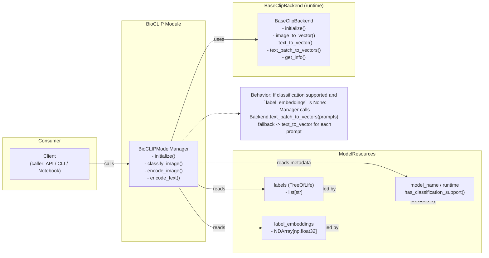

# BioCLIP Component Diagram

This document contains a component-level overview of how the `BioCLIPModelManager` relates to its primary dependencies and consumers. Use this to quickly understand the static relationships and data flow between:

- `BioCLIPModelManager` — the business-level manager implemented in `src/lumen_clip/expert_bioclip/bioclip_model.py`
- `ModelResources` — pre-loaded labels, embeddings and model metadata
- `BaseClipBackend` — the inference backend (image/text encoding, batch support, info)
- `Client` — any caller that uses the manager (API, CLI, notebook, etc.)
- data artifacts: `labels`, `label_embeddings`

Nodes and relationships:
- `BioCLIPModelManager` "reads" from `ModelResources` to obtain `labels` and `label_embeddings`.
- `BioCLIPModelManager` "uses" the `BaseClipBackend` to initialize runtime and to encode text/images.
- `Client` invokes `BioCLIPModelManager` methods such as `initialize()`, `classify_image(...)`, `encode_image(...)`, `encode_text(...)`.
- When classification is supported but `label_embeddings` are missing, the manager requests text embeddings from the `BaseClipBackend` via batch or sequential `text_to_vector` calls.

Mermaid component diagram (paste into a Mermaid renderer or compatible viewer to visualize):

Quick reference: important fields and methods to map to the diagram
- `BioCLIPModelManager.backend` — injected `BaseClipBackend`
- `BioCLIPModelManager.resources` — `ModelResources` instance
- `BioCLIPModelManager.labels` — populated from `resources.labels`
- `BioCLIPModelManager.text_embeddings` — `resources.label_embeddings` or computed via backend
- `BioCLIPModelManager.supports_classification` — `resources.has_classification_support()`
