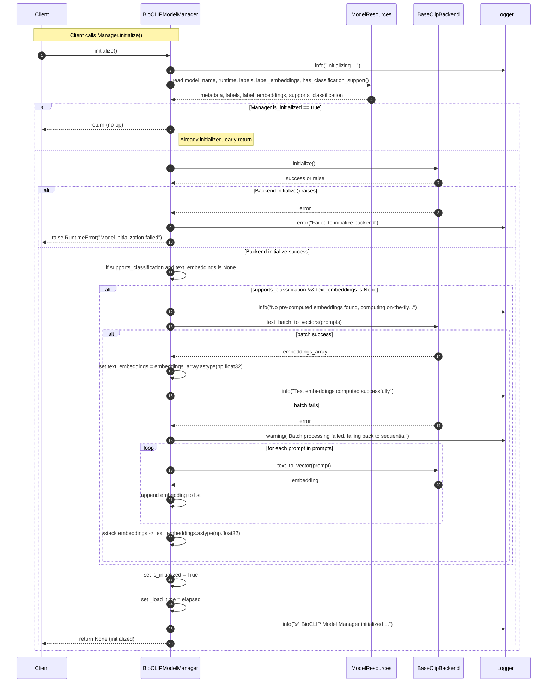

# BioCLIP Initialization Sequence

This document describes the initialization sequence for the `BioCLIPModelManager` implemented in `src/lumen_clip/expert_bioclip/bioclip_model.py`. It explains the normal flow, failure/fallback behaviors, and useful debugging tips you can use when the manager fails to initialize.

Important artifacts and attributes referenced:
- `BioCLIPModelManager.backend` — injected `BaseClipBackend` implementation.
- `BioCLIPModelManager.resources` — `ModelResources` instance (provides `labels`, `label_embeddings`, `model_name`, `runtime`).
- `BioCLIPModelManager.labels` — list of label structures derived from `resources.labels`.
- `BioCLIPModelManager.text_embeddings` — precomputed `resources.label_embeddings` or computed on-the-fly.
- `BioCLIPModelManager.supports_classification` — boolean from `resources.has_classification_support()`.
- `BioCLIPModelManager.is_initialized` — boolean set to `True` at end of successful initialization.

Initialization flow (step-by-step)
1. Client creates or obtains a `BioCLIPModelManager` instance with injected `backend` and `resources`.
2. Client calls `initialize()` on the manager. If `is_initialized` is already `True`, initialization is a no-op.
3. Manager logs initialization start and reads metadata from `resources`:
   - `model_name`, `runtime`
   - `labels` (converted to `self.labels`)
   - `label_embeddings` (set to `self.text_embeddings` if present)
   - `supports_classification` via `resources.has_classification_support()`
4. Manager calls `backend.initialize()` to start the runtime. If this fails, initialization aborts and a `RuntimeError` is raised.
5. If the model supports classification and `text_embeddings` are not present:
   - Manager builds prompts for each label (e.g., `"a photo of <label>"`).
   - Manager attempts batch embedding via `backend.text_batch_to_vectors(prompts)`.
   - If batch succeeds, result is cast to `np.float32` and stored in `self.text_embeddings`.
   - If batch fails, manager falls back to sequential calls to `backend.text_to_vector(prompt)` for each prompt, stacks the results with `np.vstack`, and casts to `np.float32`.
6. After embeddings are available (or if classification not supported), manager sets:
   - `self.is_initialized = True`
   - `self._load_time = elapsed_seconds`
7. Manager logs success with a summary and returns.

Failure modes and how to debug
- Backend initialization failure:
  - Symptoms: `RuntimeError("Model initialization failed: ...")` or logs showing backend errors.
  - Check: backend configuration, device availability (GPU/CPU), dependency compatibility.
  - Action: Inspect `Backend.get_info()` implementation, backend logs, and resource limits.

- Batch text embedding failure:
  - Symptoms: warning logs about batch failing, followed by slower sequential embedding steps.
  - Check: whether the backend implements `text_batch_to_vectors`, memory limits for batch size, or errors raised by the backend.
  - Action: allow fallback (it's automatic). If performance is a concern, investigate enabling batch support or increasing memory.

- Missing labels or corrupted `ModelResources`:
  - Symptoms: logs warning "No labels available, skipping embedding computation" or classification not supported.
  - Check: `resources.labels` presence and structure, `resources.label_embeddings` shape and dtype.
  - Action: Re-generate or reload model resources; ensure labels are in expected TreeOfLife format.

- Embedding dimensionality mismatch:
  - Symptoms: runtime errors or incorrect classification behavior (dot product shape mismatch).
  - Check: `backend.get_info().image_embedding_dim` vs `text_embeddings.shape[1]`.
  - Action: Verify backend returns embeddings with the same dimensionality for text and images; reconstrain or re-compute embeddings if mismatch exists.

Best practices
- Always call `initialize()` before inference methods (`classify_image`, `encode_image`, `encode_text`). These methods call `_ensure_initialized()` and will raise if the manager is not initialized.
- If you expect large label sets, prefer precomputing and storing `label_embeddings` in `ModelResources` to avoid runtime computation cost.
- Ensure `ModelResources.has_classification_support()` reflects the actual dataset presence; this drives whether classification is permitted.
- When adding a new `BaseClipBackend` implementation, test both single and batch text embedding paths to ensure fallback logic is exercised.

Quick checklist for troubleshooting init issues
- [ ] Does `backend.initialize()` succeed on its own (outside manager)?
- [ ] Are `resources.labels` present and look reasonable?
- [ ] If `resources.label_embeddings` exists, is its dtype `float32` and dimension consistent?
- [ ] Does `backend.text_batch_to_vectors` exist and work for a small test batch?
- [ ] Check logs for any stack traces emitted during initialization.
